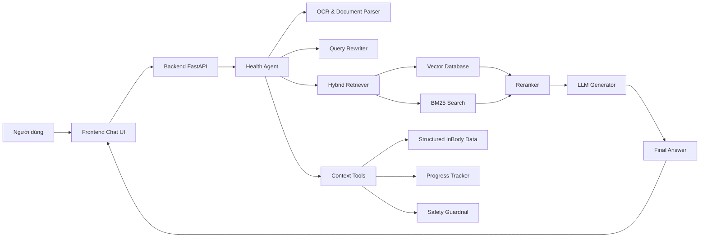

# Health Chatbot Agent RAG

## I. Tổng Quan

Dự án xây dựng hệ thống chatbot hỏi đáp sức khỏe ứng dụng Agent RAG, tập trung vào phân tích báo cáo InBody và tư vấn cải thiện sức khỏe cá nhân hóa. Người dùng có thể tải lên ảnh hoặc PDF kết quả InBody, đặt câu hỏi bằng tiếng Việt, và nhận câu trả lời dựa trên dữ liệu đã trích xuất, lịch sử đo, cùng kho tri thức y khoa - dinh dưỡng được kiểm soát.

Hệ thống kết hợp các kỹ thuật OCR, phân tích bố cục tài liệu, truy xuất tri thức bằng vector database, mô hình ngôn ngữ lớn và agent tool-calling để tạo ra câu trả lời có ngữ cảnh. Mục tiêu không phải thay thế bác sĩ, mà hỗ trợ người dùng hiểu các chỉ số cơ thể, theo dõi tiến bộ và nhận khuyến nghị tham khảo về dinh dưỡng, luyện tập trong 1-2 Tuan.

## II. Bài Toán

Kết quả đo InBody thường được cung cấp dưới dạng ảnh hoặc bản in với nhiều mẫu trình bày khác nhau. Các chỉ số như BMI, khối lượng cơ xương (SMM), khối lượng mỡ (BFM), phần trăm mỡ cơ thể, mỡ nội tạng và phân bố cơ thể có thể xuất hiện dưới dạng văn bản, bảng số hoặc biểu đồ. Người dùng phổ thông thường khó hiểu ý nghĩa của các chỉ số này và chưa biết nên cải thiện sức khỏe theo hướng nào.

Dự án giải quyết các nhu cầu chính:

- Đọc ảnh/PDF báo cáo InBody và trích xuất chỉ số quan trọng.
- Chuẩn hóa dữ liệu thành hồ sơ sức khỏe có cấu trúc.
- Cho phép người dùng hỏi đáp tự nhiên bằng tiếng Việt.
- Truy xuất kiến thức liên quan từ kho tài liệu sức khỏe, dinh dưỡng, luyện tập.
- Tạo tư vấn cá nhân hóa dựa trên chỉ số InBody, mục tiêu và lịch sử người dùng.
- Lưu lịch sử để theo dõi tiến bộ theo thời gian.

## III. Mục Tiêu Dự Án

- Xây dựng hệ thống AI có khả năng đọc thông tin từ ảnh hoặc PDF báo cáo InBody với độ chính xác mục tiêu trên 85%.
- Sử dụng LLM để đọc dữ liệu InBody đã được cấu trúc hóa, đánh giá tình trạng cơ thể như thừa cân, thiếu cơ, mỡ cơ thể cao hoặc rủi ro liên quan đến mỡ nội tạng.
- Xây dựng chatbot hỏi đáp sức khỏe sử dụng Agent RAG, trả lời dựa trên tài liệu và dữ liệu cá nhân của người dùng.
- Đưa ra nhận xét, lịch tập luyện và chế độ ăn uống tham khảo cho 3-6 tháng dựa trên mục tiêu của người dùng.
- Hỗ trợ tiếng Việt, dễ sử dụng qua web hoặc ứng dụng di động.
- Tích hợp lịch sử đo InBody để theo dõi tiến bộ và cá nhân hóa phản hồi.
- Đảm bảo câu trả lời có cảnh báo an toàn, không chẩn đoán bệnh và không thay thế tư vấn y tế chuyên môn.

## IV. Phạm Vi

### Input

- Ảnh hoặc PDF báo cáo InBody.
- Câu hỏi sức khỏe của người dùng bằng tiếng Việt.
- Thông tin bổ sung tùy chọn: tuổi, giới tính, chiều cao, cân nặng, mục tiêu, mức độ vận động, bệnh nền hoặc hạn chế luyện tập.
- Lịch sử đo InBody theo thời gian.

### Output

- Báo cáo phân tích dạng văn bản/PDF.
- Tóm tắt tình trạng, ví dụ: `BMI 25.5 - thừa cân nhẹ`.
- Nhận xét chỉ số, ví dụ: `Mỡ nội tạng cao, nên ưu tiên giảm mỡ để giảm rủi ro sức khỏe`.
- Chế độ ăn uống tham khảo theo mục tiêu, ví dụ: `Giảm khoảng 300-500 kcal/ngày, tăng protein, ưu tiên thực phẩm ít chế biến`.
- Gợi ý khẩu phần hoặc macro cơ bản như calories, protein, tinh bột, chất béo theo mục tiêu giảm mỡ, tăng cơ hoặc duy trì.
- Lịch tập luyện tham khảo theo tuần/ngày, ví dụ: `Thứ 2 tập thân trên, Thứ 3 cardio, Thứ 4 tập thân dưới, Thứ 5 nghỉ phục hồi`.
- Kế hoạch luyện tập theo mức độ người dùng, ví dụ: `Cardio 3 buổi/tuần kết hợp tập kháng lực 2 buổi/tuần`.
- Câu trả lời chatbot có trích dẫn hoặc nguồn tham khảo từ kho tri thức.
- Cảnh báo an toàn khi câu hỏi liên quan đến bệnh lý, thuốc, triệu chứng nguy hiểm hoặc tình huống cần gặp bác sĩ.

## V. Kiến Trúc Agent RAG



### Các thành phần chính

- **Frontend Chat UI:** giao diện trò chuyện, upload ảnh/PDF InBody, xem lịch sử và báo cáo.
- **Backend FastAPI:** cung cấp API chat, API upload, quản lý phiên trò chuyện và người dùng.
- **Health Agent:** điều phối các công cụ như OCR, truy xuất tài liệu, lấy dữ liệu InBody đã cấu trúc, kiểm tra an toàn và gọi LLM sinh câu trả lời.
- **OCR & Document Parser:** dùng PaddleOCR, OpenCV và Document Layout Analysis để đọc báo cáo InBody.
- **Hybrid Retriever:** kết hợp vector search và BM25 để tìm tài liệu liên quan.
- **Reranker:** xếp hạng lại tài liệu truy xuất để tăng độ chính xác ngữ cảnh.
- **LLM Generator:** đánh giá dữ liệu InBody, tạo bản tóm tắt và sinh câu trả lời tiếng Việt dựa trên context RAG, hồ sơ người dùng và chính sách an toàn.
- **Context Tools:** cung cấp dữ liệu InBody đã trích xuất, lịch sử tiến bộ, tài liệu liên quan và cảnh báo y tế cho LLM.
- **Database:** lưu người dùng, lịch sử chat, lịch sử đo InBody và metadata tài liệu.
- **Vector Database:** lưu embedding của tài liệu sức khỏe, dinh dưỡng, luyện tập và mô tả chỉ số InBody.

## VI. Luồng Hoạt Động

### 1. Luồng xử lý báo cáo InBody

1. Người dùng tải lên ảnh hoặc PDF báo cáo InBody.
2. Hệ thống tiền xử lý ảnh: xoay, khử nhiễu, tăng tương phản, cắt vùng quan trọng.
3. OCR trích xuất văn bản, bảng số và nhãn chỉ số.
4. Document parser chuẩn hóa dữ liệu thành schema: BMI, SMM, BFM, PBF, visceral fat, weight, muscle-fat analysis.
5. Dữ liệu đã cấu trúc được lưu vào database để dùng cho hỏi đáp và theo dõi tiến bộ.
6. Khi người dùng yêu cầu phân tích, LLM sử dụng dữ liệu InBody, lịch sử đo, context RAG và guardrail y tế để tạo nhận xét, đánh giá và bản tóm tắt.

### 2. Luồng hỏi đáp Agent RAG

1. Người dùng đặt câu hỏi, ví dụ: `Tôi nên giảm mỡ hay tăng cơ trước?`
2. Query Rewriter viết lại câu hỏi để phù hợp truy xuất tài liệu.
3. Retriever tìm kiến thức liên quan từ kho tài liệu sức khỏe, dinh dưỡng và luyện tập.
4. Agent lấy dữ liệu InBody đã cấu trúc, lịch sử đo và dữ liệu cá nhân cần thiết.
5. Safety Guardrail kiểm tra câu hỏi có rủi ro y tế hay không.
6. LLM tạo câu trả lời có ngữ cảnh, dễ hiểu, có khuyến nghị hành động và cảnh báo phù hợp.
7. Hệ thống lưu lịch sử chat và phản hồi.

## VII. Công Nghệ Sử Dụng

### Backend

- **FastAPI:** xây dựng REST API và streaming chat.
- **Pydantic:** validate request/response và schema dữ liệu InBody.
- **SQLAlchemy:** ORM cho metadata, lịch sử chat và hồ sơ người dùng.
- **Celery + Redis:** xử lý tác vụ nền như OCR, vectorize tài liệu, tạo báo cáo PDF.

### AI, RAG và Agent

- **LLM:** GPT, LLaMA hoặc mô hình tương đương để sinh câu trả lời.
- **Embedding model:** BGE-M3 hoặc multilingual sentence transformers.
- **QdrantDB:** vector database cho truy xuất tài liệu.
- **BM25:** tìm kiếm keyword truyền thống.
- **Reranker:** xếp hạng lại kết quả truy xuất.
- **Query Rewriter:** tối ưu câu hỏi trước khi retrieval.
- **Agent tool-calling:** điều phối OCR, lấy dữ liệu InBody đã cấu trúc, truy xuất tri thức và guardrail.

### OCR và xử lý tài liệu

- **PaddleOCR:** nhận diện ký tự từ ảnh/PDF.
- **OpenCV:** tiền xử lý ảnh.
- **Document Layout Analysis:** nhận diện vùng bảng, vùng chỉ số và vùng biểu đồ.

### Frontend

- **Streamlit hoặc ReactJS:** giao diện chat, upload file và xem báo cáo.
- **Web UI:** ưu tiên triển khai web để dễ kiểm thử và demo.

### Infrastructure

- **Docker:** đóng gói dịch vụ.
- **Docker Compose:** chạy backend, frontend, database, Redis và Qdrant.
- **PostgreSQL/MySQL:** lưu dữ liệu nghiệp vụ.

## VIII. Cấu Trúc Dự Án Dự Kiến

```text
LLL RAG/
├── backend/
│   ├── src/
│   │   ├── app.py                  # FastAPI application
│   │   ├── agent.py                # Health Agent orchestration
│   │   ├── brain.py                # LLM chat logic
│   │   ├── models.py               # Pydantic schemas
│   │   ├── query_rewriter.py       # Query rewriting
│   │   ├── rerank.py               # Reranking
│   │   ├── vectorize.py            # Vector database operations
│   │   ├── splitter.py             # Document chunking
│   │   ├── summarizer.py           # Summarization
│   │   ├── inbody_parser.py        # OCR result parser and data normalizer
│   │   ├── context_tools.py        # Retrieve structured InBody data for LLM
│   │   ├── safety_guardrail.py     # Medical safety checks
│   │   └── progress_tracker.py     # User progress analysis
│   ├── data/
│   ├── requirements.txt
│   └── docker-compose.yml
│
├── frontend/
│   ├── chat_interface.py           # Chat UI
│   ├── requirements.txt
│   └── docker-compose.yml
│
├── data_pipeline/
│   ├── configs/                    # Pipeline configs and schema mappings
│   ├── dataset/                    # Raw, processed, RAG, InBody samples, benchmark
│   ├── utils/                      # Data cleaning and indexing scripts
│   └── logs/                       # Pipeline logs and ingest reports
│
├── database/
│   └── init.sql                    # Database schema
│
├── docs/
│   └── architecture_template.drawio
│
├── asset/
│   └── architecture_template.drawio.svg
│
├── text.md                         # Tóm tắt đề tài tốt nghiệp
└── README.md                       # Tài liệu dự án
```

## IX. Schema Dữ Liệu InBody Dự Kiến

```json
{
  "user_id": "string",
  "measurement_date": "2026-05-19",
  "height_cm": 170,
  "weight_kg": 72.5,
  "bmi": 25.1,
  "smm_kg": 30.2,
  "bfm_kg": 18.4,
  "pbf_percent": 25.3,
  "visceral_fat_level": 9,
  "body_water_l": 38.5,
  "recommendation_goal": "fat_loss",
  "source_file": "inbody_report.pdf"
}
```

## X. Guardrail Y Tế

Hệ thống cần tuân thủ các nguyên tắc an toàn:

- Không chẩn đoán bệnh.
- Không tự ý kê đơn thuốc, liều thuốc hoặc thay thế phác đồ điều trị.
- Luôn khuyến nghị gặp bác sĩ khi có triệu chứng nguy hiểm hoặc bệnh nền phức tạp.
- Phân biệt rõ lời khuyên tham khảo với tư vấn y tế chuyên môn.
- Trả lời dựa trên nguồn tri thức đã truy xuất, tránh suy đoán khi thiếu dữ liệu.
- Không đưa kế hoạch ăn kiêng hoặc luyện tập cực đoan.

## XI. Roadmap Triển Khai

### Giai đoạn 1: MVP

- Xây dựng API chat cơ bản.
- Tạo frontend chat và upload file.
- Index kho tài liệu sức khỏe ban đầu.
- Tích hợp vector search, BM25 và reranker.
- Tạo agent trả lời câu hỏi sức khỏe có RAG.

### Giai đoạn 2: Phân tích InBody

- Tích hợp OCR cho ảnh/PDF.
- Parse các chỉ số InBody quan trọng.
- Tạo báo cáo phân tích cơ bản.
- Lưu lịch sử đo của người dùng.

### Giai đoạn 3: Cá nhân hóa

- Theo dõi tiến bộ theo thời gian.
- Sinh khuyến nghị dinh dưỡng và luyện tập theo mục tiêu.
- Tạo dashboard so sánh các lần đo.
- Cải thiện guardrail y tế.

### Giai đoạn 4: Hoàn thiện

- Xuất báo cáo PDF.
- Đánh giá độ chính xác OCR và chất lượng trả lời.
- Tối ưu triển khai Docker.
- Chuẩn bị demo và tài liệu tốt nghiệp.

## XII. Tiêu Chí Đánh Giá

- Độ chính xác OCR trên báo cáo InBody: mục tiêu trên 85%.
- Tỷ lệ trích xuất đúng các chỉ số chính: BMI, SMM, BFM, PBF, visceral fat.
- Chất lượng truy xuất RAG: context liên quan, ít nhiễu, có nguồn tham khảo.
- Chất lượng câu trả lời: đúng ngữ cảnh, dễ hiểu, có hành động cụ thể.
- An toàn y tế: không chẩn đoán, không kê đơn, có cảnh báo khi cần.
- Trải nghiệm người dùng: upload dễ, chat nhanh, lịch sử rõ ràng.

## XIII. Ghi Chú

Dự án là hệ thống hỗ trợ tham khảo về sức khỏe, dinh dưỡng và luyện tập. Kết quả phân tích không thay thế bác sĩ, chuyên gia dinh dưỡng hoặc huấn luyện viên cá nhân. Với các vấn đề bệnh lý, triệu chứng bất thường, phụ nữ mang thai, người cao tuổi hoặc người có bệnh nền, người dùng cần tham khảo chuyên gia y tế trước khi áp dụng khuyến nghị.
